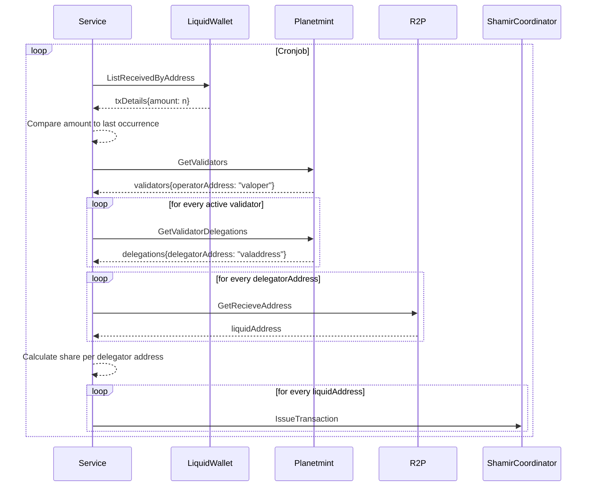

# distribution-service
This service is responsible for the distribution of 10% of the DAOs daily received funds between all validators. This ensures that the validators always have sufficient funds to operate on the network.

## Mechanics


## Configuration
The service needs to be configured via the ```./app.toml``` file or environment variables. The defaults are
```
asset = '7add40beb27df701e02ee85089c5bc0021bc813823fedb5f1dcb5debda7f3da9'
confirmations = 10
cron = '* * * * * *'
fund-address = ''
planetmint-rpc-host = '127.0.0.1:9090'
r2p-host = 'planetmint-go-testnet-3.rddl.io'
rpc-host = 'planetmint-go-testnet-3.rddl.io:18884'
rpc-pass = 'password'
rpc-user = 'user'
shamir-host = '127.0.0.1:9091'
wallet = 'dao'
```

## Data storage
This service stores every occurrence of a distribution in a LevelDB. It needs this to compare how much tokens have been received by the DAO wallet since the last occurrence.