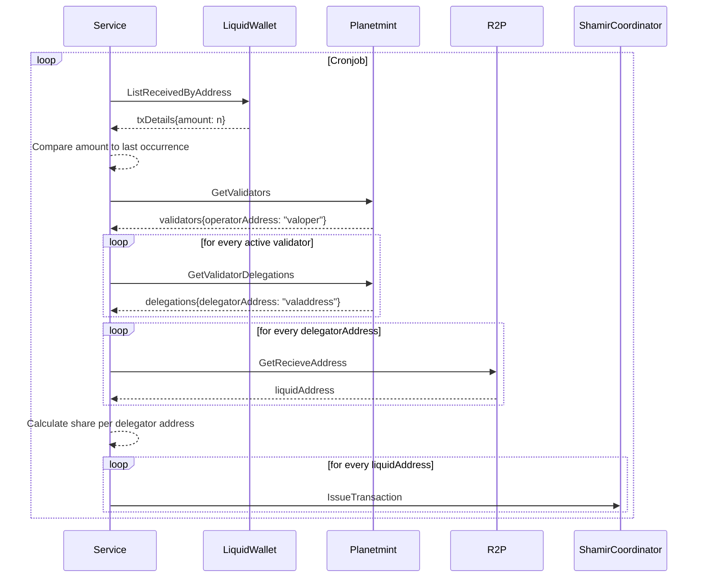

# distribution-service
This service is responsible for the distribution of 10% of the DAOs daily received funds between all validators. This ensures that the validators always have sufficient funds to operate on the network.

## Mechanics


## Execution
The service can be executed via the following go command without having it previously built:
```
go run cmd/rddl-claim-service/main.go
```

The distribution funcionality can also be triggered manually by passing the distribute flag:
```
go run cmd/rddl-claim-service/main.go --distribute=true
```

## Configuration
The service needs to be configured via the ```./app.toml``` file or environment variables. The defaults are
```
asset = '7add40beb27df701e02ee85089c5bc0021bc813823fedb5f1dcb5debda7f3da9' //  liquid asset
certs-path = './certs/' // to tls authenticate against shamir coordinator
confirmations = 10 // min number of confirmations on liquid
cron = '* * * * * *' // cron expression for periodic exectution
fund-address = '' // liquid address that receives funds to distribute
planetmint-rpc-host = 'localhost:9090' // plmnt rpc host
r2p-host = 'https://testnet-r2p.rddl.io' // r2p host
rpc-host = 'localhost:18884' // elements rpc host
rpc-pass = 'password' // elements rpc password
rpc-user = 'user' // elements rpc user
shamir-host = 'https://localhost:9091' // shamir coordinator
wallet = 'dao' // read only liquid wallet
```

### Logging
The logger defaults to "error" but can be set via environment variable to the these levels `LOG_LEVEL=debug|info|warn|error`

## Data storage
This service stores every occurrence of a distribution in a LevelDB. It needs this to compare how much tokens have been received by the DAO wallet since the last occurrence.